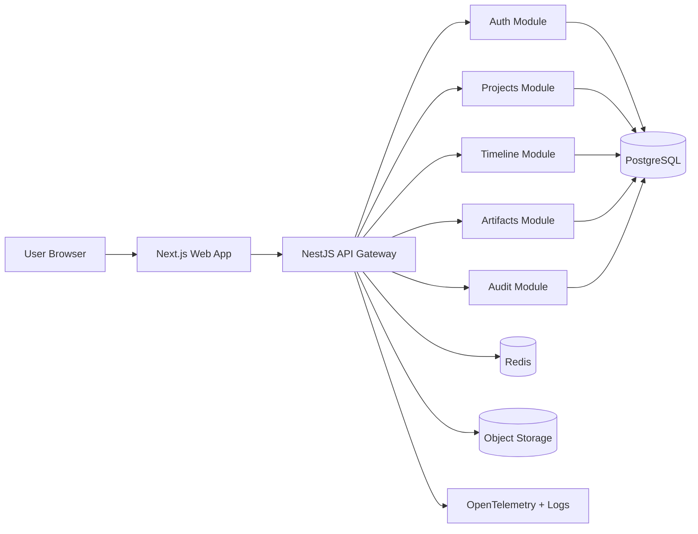
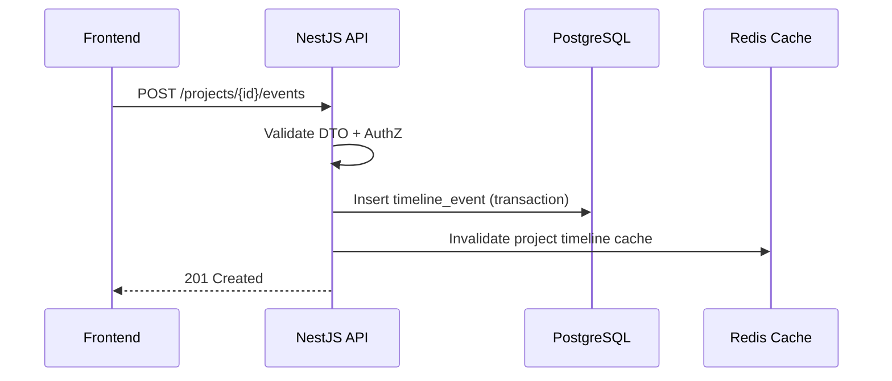
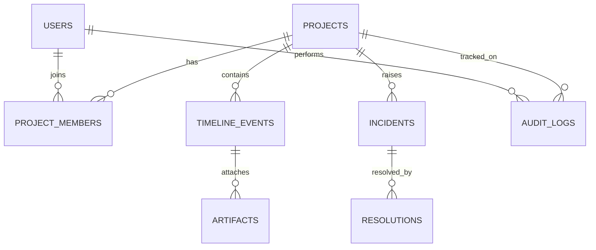
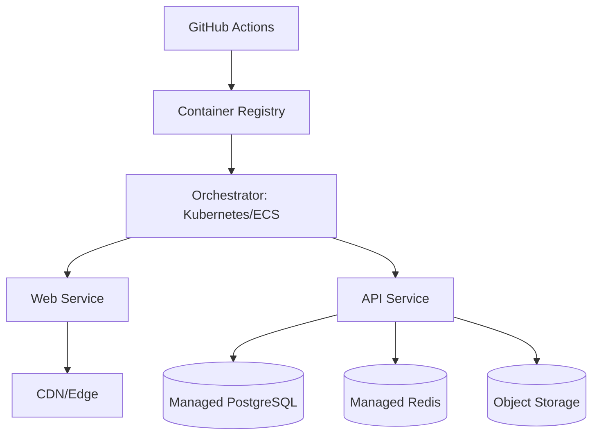

# SYSTEM DESIGN — SWARMINSYM Project Tracker

## 1. Purpose
This document defines the target architecture for a web platform that tracks SWARMINSYM project lifecycle phases (prompt → planning → coding → debugging → deployment) with full visibility into decisions, artifacts, and outcomes.

## 2. Architecture Overview

## Technology Stack
## 3. Technology Stack
- **Frontend**: Next.js 15 (App Router), React 19, TypeScript, TailwindCSS, TanStack Query, Zod, Zustand.
- **Backend**: NestJS (TypeScript), class-validator, Swagger/OpenAPI, Prisma ORM.
- **Database**: PostgreSQL 16.
- **Cache/Session/Rate limiting**: Redis 7.
- **Storage**: S3-compatible object store (for large artifacts/log bundles).
- **Auth/Security**: JWT (access + refresh), bcrypt/argon2 password hashing, Helmet, CORS policy.
- **Infra**: Docker, GitHub Actions CI/CD, Kubernetes or ECS Fargate, NGINX ingress.
- **Observability**: OpenTelemetry, Prometheus metrics, Grafana dashboards, centralized logs (Loki/ELK).

## Frontend Architecture
## 4. Frontend Architecture
### 4.1 App Layers
- **Presentation Layer**: route-based pages and reusable UI components.
- **State Layer**: TanStack Query for server state; Zustand for local UI state.
- **Domain UI Modules**:
  - Projects Dashboard
  - Project Details
  - Timeline Viewer
  - Event Composer
  - Incident & Resolution Panels

### 4.2 Frontend Responsibilities
- Render project summary cards and timeline views.
- Enable filtering by phase/status/tag/date.
- Post timeline events/artifacts.
- Display API/network errors consistently.

### 4.3 Client Security
- Store access token in memory; refresh via secure HttpOnly cookie flow.
- Escape and sanitize user-generated rich content before render.
- Route guards for role-based access.

## Backend Architecture
## 5. Backend Architecture
### 5.1 Module Structure (NestJS)
- `AuthModule`: login, refresh, revoke, RBAC guard.
- `UsersModule`: profile and role management.
- `ProjectsModule`: project CRUD + metadata.
- `TimelineModule`: lifecycle events, milestones, debugging logs.
- `ArtifactsModule`: file metadata + signed upload/download URLs.
- `SearchModule`: full text and faceted filtering.
- `AuditModule`: immutable audit entries.
- `HealthModule`: liveness/readiness.

### 5.2 Internal Patterns
- Controller → Service → Repository pattern.
- DTO validation (Zod or class-validator) at boundary.
- Transactional write operations for project + timeline consistency.
- Domain events emitted for analytics/notifications.

## Database Schema Overview
## 6. Database Schema Overview

### 6.1 Core Entities
- `users`
- `projects`
- `project_members`
- `timeline_events`
- `artifacts`
- `incidents`
- `resolutions`
- `audit_logs`

### 6.2 Relational Model

### 6.3 Table Summary
- **users**: id, email(unique), password_hash, display_name, role, created_at
- **projects**: id, name, slug(unique), description, status, created_by, created_at, updated_at
- **project_members**: id, project_id, user_id, role, joined_at
- **timeline_events**: id, project_id, phase, event_type, title, body, severity, created_by, created_at
- **artifacts**: id, event_id, type, url, checksum, metadata_json, created_at
- **incidents**: id, project_id, title, impact_level, status, opened_at, closed_at
- **resolutions**: id, incident_id, summary, root_cause, action_items_json, created_at
- **audit_logs**: id, actor_user_id, project_id, action, target_type, target_id, payload_json, created_at

## API Design Patterns
## 7. API Design Patterns
- RESTful resource naming under `/api/v1`.
- Cursor pagination for list endpoints (`cursor`, `limit`).
- Strongly typed envelopes:
  - Success: `{ data, meta }`
  - Error: `{ error: { code, message, details, traceId } }`
- Idempotency key support on write-heavy endpoints (`Idempotency-Key` header).
- ETag/If-None-Match on high-read resources where feasible.

## 8. Security Architecture
- JWT access tokens (15 min) + refresh token rotation (7 days).
- Refresh token family revocation on suspicious behavior.
- RBAC roles: `viewer`, `editor`, `admin`.
- Rate limits per IP + user on auth and write endpoints.
- Input validation and content-size constraints for prompt/log ingestion.
- Audit logging for privileged operations.

## Deployment Strategy
## 9. Deployment Strategy
### 9.1 Environments
- `dev`: feature validation
- `staging`: pre-prod verification
- `prod`: live traffic

### 9.2 CI/CD Pipeline
1. Lint + unit tests + docs tests
2. Build frontend/backend images
3. Run SAST + dependency checks
4. Deploy to staging (blue/green)
5. Smoke tests
6. Manual approval gate
7. Deploy to production

### 9.3 Runtime Topology

## 10. Scalability & Reliability
- Stateless API pods with HPA based on CPU + RPS.
- Read-heavy caching for project/timeline queries.
- DB indexing on `(project_id, created_at)` and event filters.
- Point-in-time recovery backups for PostgreSQL.
- Multi-AZ deployment for critical services.

## 11. Operational Readiness
- Health endpoints: `/health/live`, `/health/ready`.
- SLO dashboards for latency, error rate, and saturation.
- Alerting for auth anomalies, error spikes, DB saturation.

## 12. Trade-offs
- Modular monolith chosen over microservices for team velocity.
- REST chosen over GraphQL for straightforward client/server contracts and easier observability.
ity.
